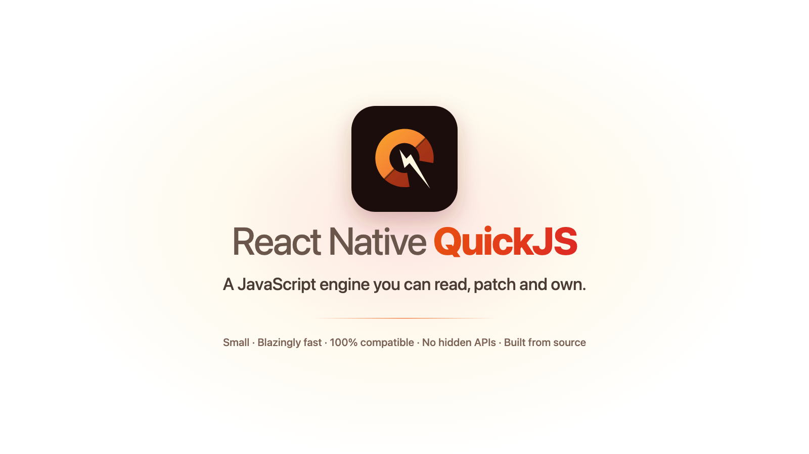

<!-- GitHub strips <style> from SVG in Markdown, so the animated banner would
     render as a still here anyway — this points at the PNG. The SVG in
     docs/public/banner.svg is the source of truth and animates everywhere
     else. -->
<p align="center">
  
</p>

<h1 align="center">react-native-quickjs</h1>

<p align="center">
  A <a href="https://github.com/quickjs-ng/quickjs">QuickJS</a> JSI runtime for
  React Native, compiled from source in every app.
</p>

<p align="center">
  <a href="https://www.npmjs.com/package/@react-native-quickjs/quickjs"></a>
  <a href="LICENSE"></a>
</p>

Provides a `jsi::Runtime` backed by quickjs-ng, and the `JSRuntimeFactory` glue
React Native uses to select it. The engine is compiled from source as part of
the app build. Neither Hermes nor JavaScriptCore is linked into the result.

> **Alpha.** See [Known limitations](#known-limitations). Breaking changes are
> expected.

## Requirements

- React Native **0.85 or newer**, New Architecture enabled
- iOS 15.1+ · Android 7.0+ (API 24)

## Install

```sh
npm install @react-native-quickjs/quickjs@alpha
npx react-native-quickjs install
cd ios && pod install
```

For Expo, add the config plugin instead and run `expo prebuild`:

```json
{ "expo": { "plugins": ["@react-native-quickjs/quickjs"] } }
```

`npx react-native-quickjs doctor` reports which parts are configured, and
`revert` puts the app back on Hermes.

The two sections below are the changes `install` makes. Follow them by hand if
you would rather, or if `install` reports a file it could not edit.

## iOS

**1. Podfile**

```ruby
require_relative '../node_modules/@react-native-quickjs/quickjs/scripts/react_native_quickjs_pods.rb'

target 'YourApp' do
  config = use_native_modules!

  use_quickjs!                       # must precede use_react_native!

  use_react_native!(:path => config[:reactNativePath])

  post_install do |installer|
    react_native_post_install(installer, config[:reactNativePath])
    react_native_quickjs_post_install(installer)   # must follow it
  end
end
```

`use_quickjs!` removes Hermes from the pod graph.
`react_native_quickjs_post_install` sets `USE_HERMES=false`, which stops release
builds compiling the bundle to Hermes bytecode.

**2. AppDelegate.swift**

```swift
import ReactNativeQuickJS

class ReactNativeDelegate: RCTDefaultReactNativeFactoryDelegate {
  override func createJSRuntimeFactory() -> JSRuntimeFactoryRef {
    jsrt_create_quickjs_factory()
  }
}
```

Then run `pod install`.

## Android

**1. `android/gradle.properties`**

```properties
hermesEnabled=false
```

**2. `android/app/build.gradle`** — remove the engine selection block:

```diff
 dependencies {
     implementation("com.facebook.react:react-android")
-
-    if (hermesEnabled.toBoolean()) {
-        implementation("com.facebook.react:hermes-android")
-    } else {
-        implementation jscFlavor
-    }
 }
```

`libjsc.so` is about 10 MB per architecture. The build warns if either
dependency is still declared.

**3. `android/app/build.gradle`** — apply the Gradle script, as the last line:

```groovy
apply from: file("../../node_modules/@react-native-quickjs/quickjs/android/quickjs.gradle")
```

React Native strips the engine the app is not using, and with only two engines
to choose from it reads "not Hermes" as "delete `libhermesvm.so`" — the name the
Hermes compatibility shim has to carry for `react-native-worklets` to find it.
This script does the same removals, minus that one file, and fails the build if
a real Hermes ever reaches packaging.

**4. `MainApplication.kt`**

```kotlin
import com.reactnativequickjs.quickjs.QuickJSInstance

override val reactHost: ReactHost by lazy {
  getDefaultReactHost(
    context = applicationContext,
    packageList = PackageList(this).packages,
    jsRuntimeFactory = QuickJSInstance(),
  )
}
```

## Debugging

Chrome DevTools attaches over React Native's inspector: breakpoints, stepping,
call stacks, scope inspection and console. The backend is compiled into debug
builds and omitted from release builds.

## Bytecode bundles

Release builds compile the JavaScript bundle to QuickJS bytecode, which is what
the app then loads. Debug builds are untouched -- they load JavaScript from
Metro. There is nothing to configure.

The compiler is pinned to the engine by `BC_VERSION`, because bytecode is only
loadable by the engine build that produced it. If the two ever disagree the
build stops rather than shipping a bundle the app cannot read.

Set `RNQJS_BYTECODE=0` (iOS) or `-PrnqjsBytecode=false` (Android) to ship plain
JavaScript instead.

## Hermes compatibility

Many React Native libraries create their own JavaScript runtime by calling into
Hermes directly -- `react-native-worklets` does, and so `react-native-reanimated`
does through it. They include `<hermes/hermes.h>` and link the Hermes library by
name, neither of which exists in a QuickJS app.

A compatibility shim ships that header and library, backed by this engine, so
those libraries build and run unmodified. `makeHermesRuntime()` returns a QuickJS
runtime; on Android the library is named `libhermesvm.so`, which is the name they
look for. It is about 100 KB and contains no second engine.

This is on by default. `RNQJS_HERMES_COMPAT=0` (iOS) or `-PrnqjsHermesCompat=false`
(Android) turns it off, which is worth doing only if nothing in the app wants
Hermes: with it on, any library that feature-detects `__has_include(<hermes/hermes.h>)`
takes its Hermes path, and gets this engine.

The shim covers the whole public Hermes API. Calls that have no QuickJS meaning
return sensible values rather than failing, and report themselves once through
`hermes-compat/Diagnostics.h`.

## Known limitations

| | |
|---|---|
| **iOS compiles React Native core from source** | `use_quickjs!` sets `RCT_USE_PREBUILT_RNCORE=0`. On the prebuilt path `hermesvm.framework` also carries the JSI implementation, so removing Hermes removes JSI with it. First builds and cold CI are slower. |
| **Conditional breakpoints always stop** | A breakpoint `condition` is stored and reported back, never evaluated. |
| **React Native is patched at `pod install`** | `scripts/react_native_quickjs_pods.rb` applies five workarounds to React Native 0.85's non-Hermes path. Each fails with a named error if React Native changes. |

## Building this repository

```sh
git clone --recurse-submodules https://github.com/react-native-quickjs/quickjs
cd quickjs && npm install
npm test          # configures, builds, and runs the suites
```

| Path | What it is |
| --- | --- |
| `src/` | The `jsi::Runtime` implementation, shared by both platforms. |
| `android/` | Gradle module, CMake build, fbjni hybrid, and `QuickJSInstance.kt`. |
| `apple/` | `jsrt_create_quickjs_factory()`, the iOS entry point. |
| `engine/quickjs-ng/` | quickjs-ng, as a pinned git submodule. |
| `engine/patches/` | The engine patches applied to it. See [its README](engine/patches/README.md). |
| `engine/quickjs-rel/` | Generated: the submodule with the patches applied. This is what ships. |
| `modules/cdp/` | The Chrome DevTools Protocol backend, in C. See [its README](modules/cdp/README.md). |
| `cmake/quickjs.cmake` | The quickjs target, shared by the Android and host builds. |
| `tools/bytecode/` | `qjsc`, the ahead-of-time bytecode compiler. |
| `tests/` | Host suites, Hermes' JSI conformance suite, and the differential corpus. |
| `example/` | An app that runs on QuickJS, used as the end-to-end check. |
| `docs/` | The landing page. |

`engine/quickjs-rel` is generated, never hand-edited. The build fails if it
disagrees with the submodule plus the patches.

## License

MIT. QuickJS-ng is MIT, © Fabrice Bellard, Charlie Gordon and the quickjs-ng
contributors.
